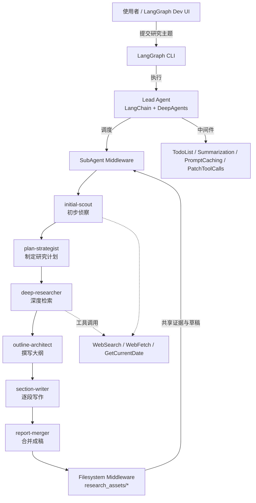

# langchain-deepresearch

只保留 Research Agent v3 的精简版本（单项目结构）。该智能体围绕“初步侦察 → 计划 → 深度搜索 → 大纲 → 逐段撰写 → 合并成稿”的流水线工作，所有阶段通过文件系统协作，最终输出 Markdown 报告。



## 项目结构

- `research_agent.py`：主入口（LangGraph 图对象 `agent`）。
- `tools.py`：外部工具（`WebSearch`、`WebFetch`、`GetCurrentDate`）。
- `prompts/`：各子代理的系统提示词。
- `langgraph.json`：LangGraph CLI 配置。
- `requirements.txt`：依赖清单（从 PyPI 安装 `deepagents`，不再依赖子模块）。
- `env.example`：环境变量模板。

## 先决条件

- Python 3.12（推荐使用 [uv](https://github.com/astral-sh/uv) 管理依赖）。
- API Key：兼容 Anthropic 的模型端点与 Tavily 搜索。

必需环境变量（复制 `env.example` 为 `.env` 并填写）：

- `TAVILY_API_KEY`
- `ANTHROPIC_AUTH_TOKEN`
- `ANTHROPIC_BASE_URL`（如使用兼容端点可自定义）
- `ANTHROPIC_DEFAULT_SONNET_MODEL`（例如 `glm-4.6`）

## 快速开始

```bash
# 1) 创建虚拟环境（可用你习惯的方式）
uv venv --python 3.12
source .venv/bin/activate

# 2) 安装依赖（使用 PyPI 的 deepagents，无需子模块）
uv pip install -r requirements.txt

# 3) 配置环境变量
cp env.example .env
# 编辑 .env 填入密钥

# 4) 启动（默认暴露 http://127.0.0.1:2024）
uv run python -m langgraph_cli dev --config langgraph.json
```

启动后，通过 LangGraph Dev UI 或调用接口与智能体交互。图 ID 为 `research_v3`（在 `langgraph.json` 中定义）。

## 说明
- 依赖 `deepagents` 来提供文件系统、子代理调度等中间件能力。
- 智能体的产物会统一写入 `research_assets/` 目录，请在 `.env` 中配置模型与 API Key。

## 故障排查

- Tavily 报错：确认当前 shell 已导出 `TAVILY_API_KEY` 或 `.env` 生效。
- 模型不可用：检查 `ANTHROPIC_AUTH_TOKEN`、`ANTHROPIC_BASE_URL` 与模型名是否匹配。
- 仅提交 `env.example`，不要提交含密钥的 `.env`。
